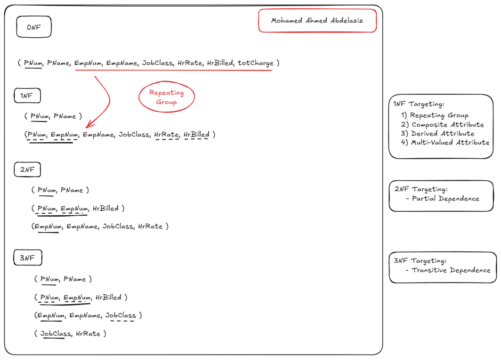

### 📄 Contents of `commands.txt`

#### Create a new project on your local machine, then push it your remote repo.
<pre>
$ git init
    Initialized empty Git repository in E:/courses/web dev/iti-saraya/iti/angela-udemy/CSS/.git/

$ git add .
    warning: in the working copy of '7.0+CSS+Cascade/index.html', LF will be replaced by CRLF the next time Git touches it
    warning: in the working copy of '7.0+CSS+Cascade/solution/solution.css', LF will be replaced by CRLF the next time Git touches it
    warning: in the working copy of '7.0+CSS+Cascade/solution/solution.html', LF will be replaced by CRLF the next time Git touches it
    warning: in the working copy of '7.0+CSS+Cascade/style.css', LF will be replaced by CRLF the next time Git touches it

$ git commit -m "1st commit"
[main (root-commit) 020bba5] 1st commit
 5 files changed, 96 insertions(+)
 create mode 100644 7.0+CSS+Cascade/goal.png
 create mode 100644 7.0+CSS+Cascade/index.html
 create mode 100644 7.0+CSS+Cascade/solution/solution.css
 create mode 100644 7.0+CSS+Cascade/solution/solution.html
 create mode 100644 7.0+CSS+Cascade/style.css

$ git remote add origin git@github.com:m0ahmedd/git-task2-iti.git
$ git branch -M main
$ git push -u origin main
    Enumerating objects: 9, done.
    Counting objects: 100% (9/9), done.
    Delta compression using up to 16 threads
    Compressing objects: 100% (8/8), done.
    Writing objects: 100% (9/9), 842.46 KiB | 6.91 MiB/s, done.
    Total 9 (delta 1), reused 0 (delta 0), pack-reused 0
    remote: Resolving deltas: 100% (1/1), done.
    To github.com:m0ahmedd/git-task2-iti.git
    * [new branch]      main -> main
    branch 'main' set up to track 'origin/main'.
</pre>

#### Create two branches (dev & test) then create one file on each branch, and push this changes to the remote repo.
<pre>
$ git switch -c dev
Switched to a new branch 'dev'

$ git add .
$ git commit -m "dev 1st commit"
    [dev e6d3fe1] dev 1st commit
    2 files changed, 35 insertions(+)
    create mode 100644 commands.txt
    create mode 100644 dev-file.txt

$ git push -u origin dev
    Enumerating objects: 5, done.
    Counting objects: 100% (5/5), done.
    Delta compression using up to 16 threads
    Compressing objects: 100% (3/3), done.
    Writing objects: 100% (4/4), 947 bytes | 473.00 KiB/s, done.
    Total 4 (delta 0), reused 0 (delta 0), pack-reused 0
    remote: 
    remote: Create a pull request for 'dev' on GitHub by visiting:
    remote:      https://github.com/m0ahmedd/git-task2-iti/pull/new/dev
    remote:
    To github.com:m0ahmedd/git-task2-iti.git
    * [new branch]      dev -> dev
    branch 'dev' set up to track 'origin/dev'.

$ git checkout -b test
    Switched to a new branch 'test'

$ git add .
$ git commit -m "test 1st commit"
    [test 4b23879] test 1st commit
    3 files changed, 28 insertions(+), 2 deletions(-)
    delete mode 100644 dev-file.txt
    create mode 100644 test-file.txt

$ git push -u origin test
    Enumerating objects: 6, done.
    Counting objects: 100% (6/6), done.
    Delta compression using up to 16 threads
    Compressing objects: 100% (3/3), done.
    Writing objects: 100% (4/4), 783 bytes | 391.00 KiB/s, done.
    Total 4 (delta 1), reused 0 (delta 0), pack-reused 0
    remote: Resolving deltas: 100% (1/1), completed with 1 local object.
    remote: 
    remote: Create a pull request for 'test' on GitHub by visiting:
    remote:      https://github.com/m0ahmedd/git-task2-iti/pull/new/test
    remote:
    To github.com:m0ahmedd/git-task2-iti.git
    * [new branch]      test -> test
    branch 'test' set up to track 'origin/test'.
</pre>
    
####  Merge these changes on Main branch and then push it to your remote main branch.

<pre>
$ git checkout -b newBranch
    Switched to a new branch 'newBranch'

$ git add new-branch.txt
=> new-branch.txt file is created and added to stage

$ git stash         // stash saves your current stash, but u have to remember it to get it back using $git stash pop.
    Saved working directory and index state WIP on newBranch: 211a34a deleting the added file at main

$ git switch main
    Switched to branch 'main'
    Your branch is ahead of 'origin/main' by 4 commits.
    (use "git push" to publish your local commits)
</pre>

 #### Create an annotated tag with tagname (v1.7)
 
<pre>
$ git add .
$ git commit -m "3rd commit"
    [main 822f4f7] 3rd commit
    1 file changed, 15 insertions(+), 7 deletions(-)

$ git tag -a v1.7 -m "version 1.7"
</pre>

####  Push it to the remote repository
<pre>
$ git push origin v1.7
    Enumerating objects: 16, done.
    Counting objects: 100% (16/16), done.
    Delta compression using up to 16 threads
    Compressing objects: 100% (14/14), done.
    Writing objects: 100% (14/14), 2.14 KiB | 168.00 KiB/s, done.
    Total 14 (delta 10), reused 0 (delta 0), pack-reused 0
    remote: Resolving deltas: 100% (10/10), completed with 2 local objects.
    To github.com:m0ahmedd/git-task2-iti.git
    * [new tag]         v1.7 -> v1.7
</pre>

#### Tell me how to list tags.

<pre>
$ git tag
    v1.7
</pre>

#### Tell me how to delete tag locally and remotely.
<pre>
$ git tag -d v1.7
    Deleted tag 'v1.7' (was aa7b2af)

$ git push origin --delete v1.7
    To github.com:m0ahmedd/git-task2-iti.git
    - [deleted]         v1.7
</pre>

# Employee DB Normalization
